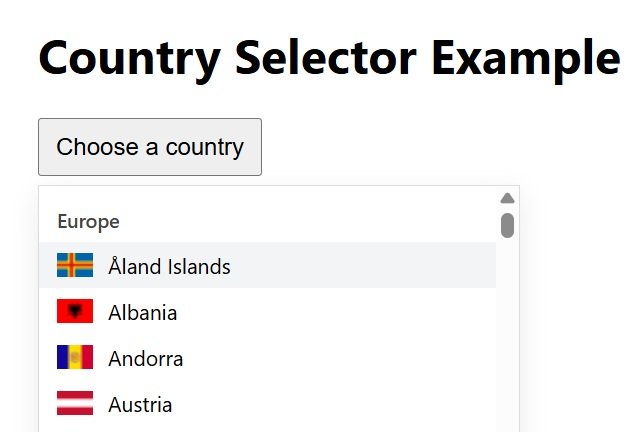

# simple-react-country-dropdown


Author: George_r

Simple React country selector dropdown with flags, grouped by continent. Works as a React component or as a lightweight web component.

Installation

```bash
npm install simple-react-country-dropdown
# or
yarn add simple-react-country-dropdown
```

Quick usage (React ESM)

```jsx
import React, { useState } from 'react'
import { CountrySelector } from 'simple-react-country-dropdown'

function App(){
	const [value, setValue] = useState('')
	return <CountrySelector value={value} onChange={setValue} />
}
```

Quick usage (web component)

```html
<script type="module">
	import plugin from './src/plugin/index.js'
	plugin.install(window, 'country-selector')
	document.querySelector('country-selector').addEventListener('change', e=>console.log(e.detail.value))
</script>

<country-selector></country-selector>
```

Screenshot



Features

- Grouped by continent (split North/South America)
- Flags via CDN
- Accessible keyboard navigation
- Usable as React component or web component

Files

- [package.json](package.json) — project manifest
- [index.html](index.html) — app entry
- [src/main.jsx](src/main.jsx) — React mount
- [src/App.jsx](src/App.jsx) — example usage
- [src/components/CountrySelector.jsx](src/components/CountrySelector.jsx) — component

Props (main)

| Prop | Type | Default | Description |
|------|------|---------|-------------|
| `groupedCountries` | Array | — | Optional precomputed groups (see `getCountries`) |
| `value` | string | `''` | Selected country code (alpha-2)
| `onChange` | function | — | (value) => void — called when selection changes
| `placeholder` | string | `Choose a country` | Placeholder text
| `flagUrl` | string | Flag CDN template | Template URL for flag images (e.g. `https://flagcdn.com/w20/{code}.png`)

Development

```bash
npm install
npm run dev
```

License

MIT — see `package.json` for details.
